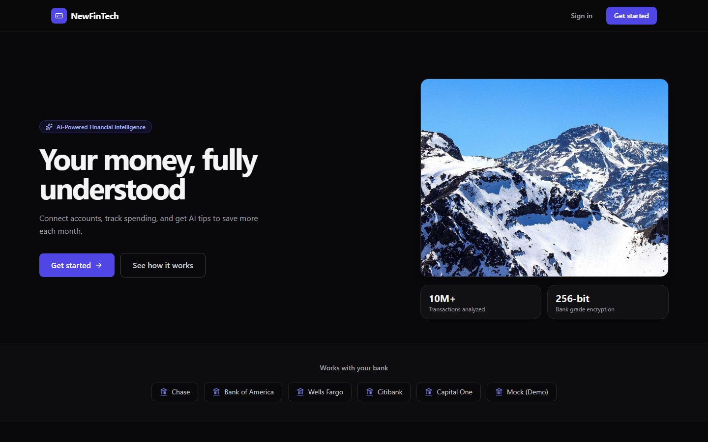
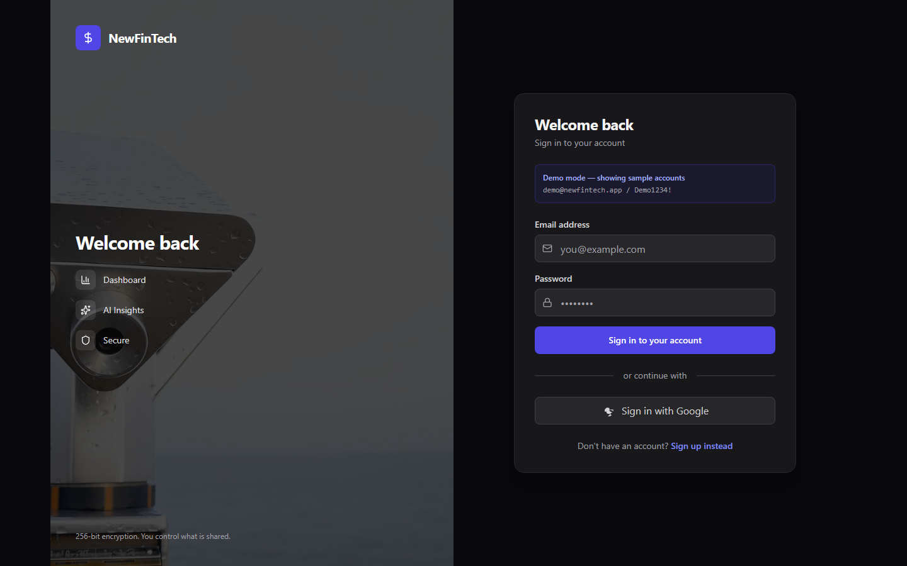
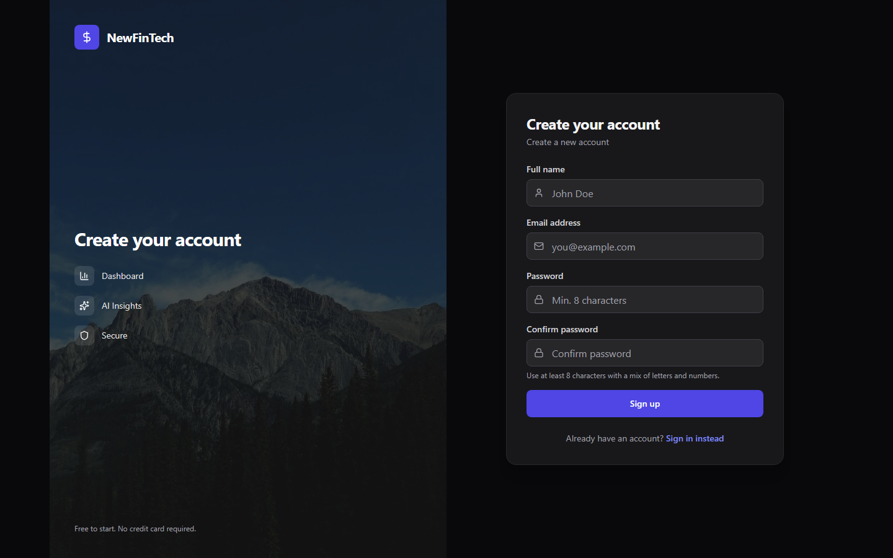

# NewFinTech



**Your money, fully understood.** Track spending, master budgets, and let AI find your savings.


## Try it now

```bash
pnpm install
cp .env.example .env        # then set a 32+ char AUTH_SECRET
npx prisma db push
pnpm run dev                # http://localhost:3000
```

Demo login: `demo@newfintech.app` / `Demo1234!`

## Platform tour

<video src="docs/showcase/tour.mp4" width="100%" controls></video>

A 20-second launch cut: dashboard, analytics, transactions, and budgets, filmed live in dark mode.

## Showcase stills

| Landing | Sign in | Register |
|---|---|---|
|  |  |  |

Dark mode throughout, Arabic RTL included, responsive from mobile to desktop.

## What is inside

- **Dashboard** with income, expenses, net savings, and transparent health score
- **Transactions** with search, filters, pagination, and review flow
- **Budgets** with period-aware windows and visible overspend tracking
- **Subscriptions** with monthly normalization and renewal countdowns
- **Analytics** with 6-month trends, category split, and top merchants
- **AI assistant** with capped context, PII minimization, and cited replies
- **Insights and notifications** with read states
- **Multi-currency guard** that refuses to silently mix currencies
- **English + Arabic** with full RTL mirroring

## Stack

Next.js 14 App Router, React 18, TypeScript, Prisma 5 (SQLite dev, Postgres path ready), NextAuth v5, next-intl, Tailwind, Recharts, Zod, bcryptjs, Vitest.

## Scripts

| Command | Purpose |
|---|---|
| `pnpm run dev` | Local dev server |
| `pnpm run build` | Production build |
| `pnpm run lint` | ESLint, zero warnings |
| `pnpm test` | Vitest suite (45 tests) |
| `npx tsc --noEmit` | Typecheck, zero errors |

## Security notes

- `.env` and `*.db` are git-ignored and untracked. Never commit them.
- Copy `.env.example` to start. Generate a secret with `openssl rand -base64 32`.
- Login, register, reset, and AI routes are rate limited with `429` + `Retry-After`.
- Bank provider tokens are encrypted at rest (AES-GCM helper in `lib/crypto.ts`).
- See `DEPLOY.md` for the Docker and Postgres runbook.

## Project structure

```
app/                  routes, pages, API handlers
  (auth)/             login, register
  (dashboard)/        dashboard, transactions, budgets, analytics, ...
  api/                accounts, budgets, subscriptions, ai, export, ...
components/           UI kit, layout, providers
lib/                  db, auth helpers, money math, rate limits, audit, crypto
prisma/               schema + SQLite dev database (local only)
messages/             en + ar locales
tests/                vitest suite + regression checklist
docs/                 showcase assets, health score model, QA reports
```

## Status

Build green, typecheck clean, 45/45 tests passing. Built by a 7-agent team (architecture, UI/UX, finance, fintech, QA, coordination, oversight) with a taste-skill design pass on top.
